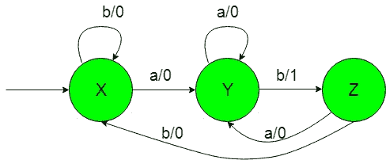

# 摩尔和米莱机器统计子串‘ab’的数量

> 原文:[https://www . geesforgeks . org/Moore-and-mealy-machines-to-count-number-substring-ab/](https://www.geeksforgeeks.org/moore-and-mealy-machines-to-count-number-of-substring-ab/)

先决条件:[米莱和摩尔机器](https://www.geeksforgeeks.org/mealy-and-moore-machines/)、[米莱机器和摩尔机器](https://www.geeksforgeeks.org/difference-between-mealy-machine-and-moore-machine/)、
**的区别问题:**以{a，b}上的所有字符串的集合作为输入并计算子字符串‘ab’
的数量的机器的构造假设，

```
Ε = {a, b} and 
Δ = {0, 1} 
```

其中ε和δ分别是输入和输出字母表。

**说明:**
所需的摩尔机构造如下。


在上图中，初始状态“X”在获得“b”作为输入时，它保持自身状态，并打印“0”作为输出，在获得“a”作为输入时，它转换到状态“Y”并打印“0”作为输出。

状态“Y”在获取“a”作为输入时，它保持自身状态并打印“0”作为输出，在获取“b”作为输入时，它传输到状态“Z”并打印“1”作为输出。获取“a”作为输入时的状态“Z”传输到状态“Y”并打印“0”作为输出，获取“b”作为输入时的状态“Z”传输到状态“X”并打印“0”作为输出。

因此，最后上面的摩尔机器可以很容易地计数子串“ab”的数量，即，在获得“ab”作为输入时，它给出“1”作为输出，因此在计数输出“1”时，我们可以很容易地计数子串“ab”。

**摩尔机到 Mealy 机的转换:**
摩尔机上方以{a，b}上的所有字符串集作为输入，每次出现“ab”时打印“1”作为输出作为子字符串。现在我们需要把上面摩尔机的过渡图转换成等价的 Mealy 机过渡图。

所需转换的步骤如下:

*   **Step-1:** Formation of State Transition Table of the above Moore machine-
    
    In the above transition table, States ‘X’, ‘Y’ and ‘Z’ are kept in the first column which on getting ‘a’ as the input it transits to ‘Y’, ‘Y’ and ‘Y’ states respectively, kept in the second column and on getting ‘b’ as the input it transits to ‘X’, ‘Z’ and ‘X’ states respectively, kept in the third column. In the fourth column under Δ, there are corresponding outputs of the first column states. In the table, An arrow (→) indicates the initial state.
*   **Step-2:** Formation of Transition Table for Mealy machine from above Transition Table of Moore machine-
    Below transition table is going to be formed with the help of the above table and its entries just by using the corresponding output of the states of the first column and placing them in the second and third column accordingly.
    
    In the above table, the states in the first column like ‘X’ on getting ‘a’ as the input it goes to a state ‘Y’ and gives ‘0’ as the output and on getting ‘b’ as the input it goes to the state ‘X’ and gives ‘0’ as the output and so on for the remaining states in the first column. In the table, An arrow (→) indicates the initial state.
*   **第三步:**最后借助上面的转换表，我们可以形成 Mealy 机器的状态转换图。
    所需的图表如下所示-
    
    上面的 Mealy 机器将{a，b}上的所有字符串集作为输入，并将“ab”每次出现时的输出打印为“1”作为子字符串。

**注意:**从摩尔转换到米莱机时，摩尔和米莱机的状态数保持不变，但在米莱到摩尔转换的情况下，它不会给出相同的状态数。