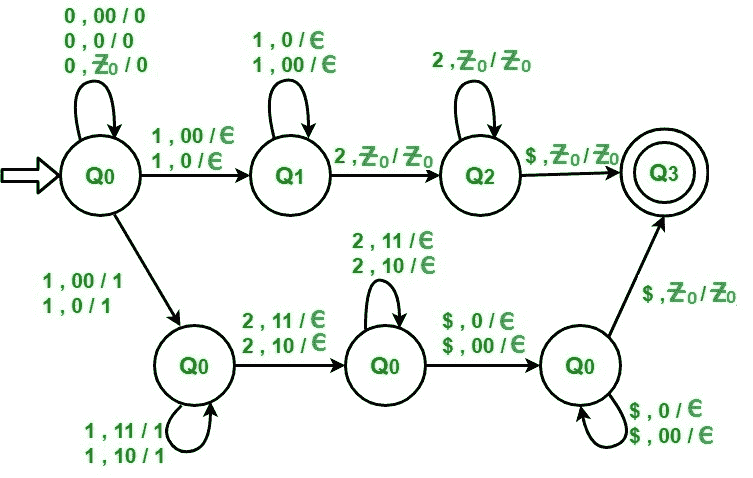

# NPDA 为 L = {0i1j2k | i==j 或 j = = k；I，j，k > = 1}

> 原文:[https://www . geesforgeks . org/npda-for-l-0i1j 2k-ij-or-JK-I-j-k-1/](https://www.geeksforgeeks.org/npda-for-l-0i1j2k-ij-or-jk-i-j-k-1/)

先决条件–[下推自动机](https://www.geeksforgeeks.org/theory-of-computation-pushdown-automata/)、[下推自动机最终状态验收](https://www.geeksforgeeks.org/pushdown-automata-acceptance-final-state/)
语言 L = { 0<sup>I</sup>1<sup>j</sup>2<sup>k</sup>| I = = j 或 j = = k；I，j，k > = 1}表示每一串“0”，“1”和“2”都有一定数量的 0，然后是一定数量的 1，然后是一定数量的 2。条件是这 3 个符号的计数应该至少为 1。这种语言的两个重要条件是，0 的计数应该等于 1 的计数，或者 1 的计数应该等于 2 的计数。假设字符串以“{content}”结尾。。

**示例:**

```
Input: 0 0 0 1 1 1 2 2 2 2 2  
        Here 0's = 3, 1's  = 3 so i = j, 2's = 5 
Output: Accepted 

Input: 0 0 1 1 1 2 2 2
        Here 0's = 2, 1's = 3, 2's = 3 so j = k
Output: Accepted

Input : 0 0 1 1 1 2 2 2 2
        Here 0's = 2, 1's = 3, 2's = 4 
Output: Not accepted 
```

解决方案有两种方法。第一个是 i==j，第二个是 j==k，它们是:

**I = = j 的步骤:**

1.  输入堆栈中的所有 0
2.  当我们得到 1 作为输入时，从堆栈中弹出一个 0 并进入下一个状态。
3.  如果输入为 1，则从堆栈中弹出 0。
4.  如果堆栈变空(即，对应于 1 的每个 0 都被弹出，因此 i = j)并且输入为 2，则忽略它并转到下一个状态。
5.  如果输入为 2，则忽略它。如果输入完成并且接收到$则进入最终状态。

**j = = k 的步骤:**

1.  输入堆栈中的所有 0
2.  当我们得到 1 作为输入时，把它推到堆栈上，进入下一个状态。
3.  如果输入为 1，则将其推到堆栈上。
4.  如果输入是 2，从堆栈中弹出 1，进入下一个状态。
5.  如果输入为 2，则从堆栈中弹出 1。如果输入完成并且收到$则从堆栈中弹出一个 0。
6.  从堆栈中弹出所有剩余的 0。如果堆栈变空，则进入最终状态。

