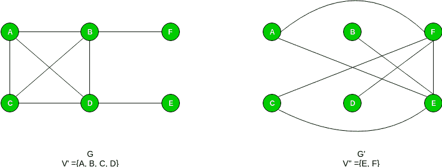

# 顶点覆盖是 NP 完全的证明

> 原文:[https://www . geesforgeks . org/proof-顶点覆盖是-np-complete/](https://www.geeksforgeeks.org/proof-that-vertex-cover-is-np-complete/)

先决条件–[顶点覆盖问题](https://www.geeksforgeeks.org/vertex-cover-problem-set-1-introduction-approximate-algorithm-2/)，[NP-完全性](https://www.geeksforgeeks.org/np-completeness-set-1/)
问题–**问题–**给定一个图 G(V，E)和一个正整数 k，问题是找出是否存在大小至多为 k 的顶点的子集 V’，使得图中的每条边都与 V’中的某个顶点相连。

**解释–**
首先让我们理解一个问题实例的概念。一个问题的实例只不过是给定问题的输入。顶点覆盖问题的一个例子是一个图 G (V，E)和一个正整数 k，问题是检查 G 中是否存在大小至多为 k 的顶点覆盖。由于 NP 完全问题，顾名思义，是一个同时存在于 NP 和 NP 难中的问题，所以证明问题是 NP 完全的陈述由两部分组成:

1.  **Proof that vertex cover is in NP –**
    If any problem is in NP, then, given a ‘certificate’ (a solution) to the problem and an instance of the problem (a graph G and a positive integer k, in this case), we will be able to verify (check whether the solution given is correct or not) the certificate in polynomial time.

    顶点覆盖问题的证明是 V 的子集 V’，它包含顶点覆盖中的顶点。我们可以使用以下策略来检查集合 V’是否是大小为 k 的顶点覆盖(对于图 G(V，E)):

    ```
    let count be an integer
    set count to 0
    for each vertex v in V’
        remove all edges adjacent to v from set E
        increment count by 1
        if count = k and E is empty
        then
            the given solution is correct
        else
            the given solution is wrong

    ```

    显而易见，这可以在多项式时间内完成。因此顶点覆盖问题属于 NP 类。

2.  **Proof that vertex cover is NP Hard –**
    To prove that Vertex Cover is NP Hard, we take some problem which has already been proven to be NP Hard, and show that this problem can be reduced to the Vertex Cover problem. For this, we consider the Clique problem, which is NP Complete (and hence NP Hard).

    > 在计算机科学中，团问题是在图中寻找团(顶点的子集，彼此相邻，也称为完全子图)的计算问题

    这里，我们考虑在给定的图中找出是否有大小为 k 的团的问题。因此，团问题的一个例子是图 G (V，E)和一个非负整数 k，我们需要检查 G 中是否存在大小为 k 的
    团。

    现在，我们需要证明团问题的任何实例(G，k)都可以简化为顶点覆盖问题的实例。考虑图 G ’,它不是由 G 中的所有边组成的，而是由使用 G 中所有顶点的完全图组成的。让我们称之为 G 的补集。现在，寻找图 G 中是否存在大小为 k 的团的问题与寻找 G’中是否存在大小为| V |–k 的顶点覆盖的问题是一样的。我们需要证明情况确实如此。

    假设 g 中有一个大小为 k 的团，让团中的顶点集为 V’。这意味着|V'| = k .在补码图 G '中，让我们选择任意边(u，V)。那么 u 或 V 中至少有一个必须在集合 V–V’中。这是因为，如果 u 和 V 都来自集合 V’，那么边(u，V)将属于 V’，这又意味着边(u，V)在 G 中。这是不可能的，因为(u，V)不在 G 中。因此，G’中的所有边都被集合 V–V’中的顶点覆盖。

    现在假设在 G '中有一个大小为| V |–k 的顶点覆盖 V ' '。这意味着 G '中的所有边都连接到 V '中的某个顶点。因此，如果我们从 G’中拾取任何一条边(u，V)，它们都不能在集合 V’之外。这意味着，u 和 V 都在集合 V”之外的所有
    边(u，V)都在 G 中，即这些边构成了大小为 k 的团。

因此，我们可以说图 G 中存在大小为 k 的团，当且仅当图 G’中存在大小为| V |–k 的顶点覆盖，因此，团问题的任何实例都可以简化为顶点覆盖问题的实例。因此，顶点覆盖是 NP 难的。由于顶点覆盖同时存在于 NP 和 NP 硬类中，所以它是 NP 完全的。

为了理解证明，考虑下面的示例图及其补充:



参见–[哈密顿路径是 NP 完全的证明](https://www.geeksforgeeks.org/proof-hamiltonian-path-np-complete/)