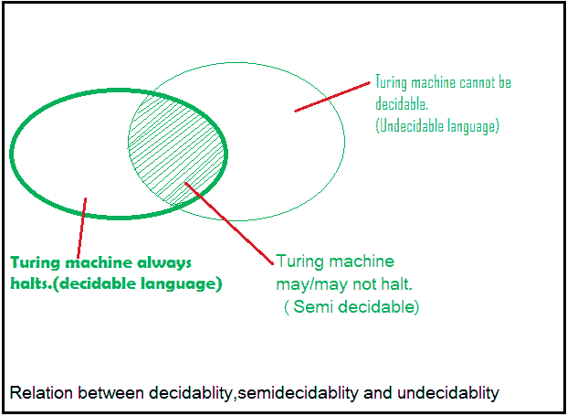

# TOC 中的不确定性和还原性

> 原文:[https://www . geeksforgeeks . org/in-TOC 不可判定性和可还原性/](https://www.geeksforgeeks.org/undecidability-and-reducibility-in-toc/)

**可判定的问题**
如果我们能构造一个图灵机，它会在有限的时间内停止每一个输入，并给出“是”或“否”的答案，那么问题就是可判定的。一个可判定的问题有一个算法来确定给定输入的答案。

**示例**

*   **两种正则语言的等价性:**给定两种正则语言，有算法和图灵机来判定两种正则语言是否等价。
*   **正则语言的有限性:**给定一个正则语言，有一个算法和图灵机来决定正则语言是否有限。
*   **上下文无关语言的空性:**给定一个上下文无关语言，有一个 CFL 是否为空的算法。

**不可判定的问题**
如果没有图灵机总是在有限的时间内停下来给出“是”或“否”的答案，那么问题就是不可判定的。不可判定的问题没有算法来确定给定输入的答案。

**示例**

*   **上下文无关语言的歧义性:**给定一个上下文无关的语言，没有哪一个图灵机会总是在有限的时间内停下来，给出语言是否有歧义的答案。
*   **两种上下文无关语言的等价性:**给定两种上下文无关语言，没有哪一种图灵机会总是在有限的时间内停顿下来，给出两种上下文无关语言是否相等的答案。
*   **CFG 的一切或完备性:**给定一个 CFG 和输入字母表，CFG 是否会生成所有可能的输入字母表的字符串(≘*)是不可判定的。
*   **CFL、CSL、REC 和 REC 的正则性:**给定一个 CFL、CSL、REC 或 REC，确定这种语言是否正则是不可判定的。

*注:两个流行的不可判定问题是 TM 和 PCP 的停顿问题(后对应问题)。半可判定问题*
半可判定问题是不可判定问题的子集，图灵机总是在有限的时间内停下来回答“是”，也可能停下来回答“否”。
半可判定问题和可判定问题之间的关系如图 1 所示:



**莱斯定理**
递归可枚举语言上的每个非平凡(答案未知)问题都是不可判定的，例如；如果一种语言是递归可枚举的，那么它的补集将是递归可枚举的，或者是不可判定的。

**可约性和不可判定性**
如果存在将 A 中的字符串转换为 B 中的字符串的函数 f，则语言 A 可约化为语言 B(表示为 A≤B)，如下所示:

```
w ɛ A <=> f(w) ɛ B
```

定理 1:如果 A≤B and B 是可判定的，那么 A 也是可判定的。
定理 2:如果 A≤B 且 A 不可判定，那么 B 也不可判定。

**问题:以下哪一项是不可判定的？**

1.  g 是一个 CFG。是 L(G)=ɸ吗？
2.  g 是一个 CFG。是 L(G)=∑*？
3.  m 是图灵机。L(M)是正规的吗？
4.  a 是 DFA，N 是 NFA。是 L(A)=L(N)？

A.仅 3
b . 3 和 4 仅
C. 1、2 和 3 仅
D. 2 和 3 仅

**说明:**

*   选项 1 是一个 CFG 是否为空，这个问题是可判定的。
*   选项 2 是一个 CFG 是否会生成所有可能的字符串(CFG 的一切或完备性)，这个问题是不可判定的。
*   选项 3 是由 TM 生成的语言是否是正则的是不可判定的。
*   选项 4 是 DFA 和 NFA 生成的语言是否相同是可判定的。所以选项 D 是正确的。

**问题:以下哪些问题是可以判定的？**

1.  给定的程序会产生输出吗？
2.  如果 L 是上下文无关语言，那么 L’也是上下文无关的？
3.  如果 L 是正则语言，那么 L’也是正则的？
4.  如果 L 是递归语言，那么 L’也是递归的？

A.1，2，3，4
B. 1，2
C. 2，3，4
D. 3，4

**说明:**

*   由于正则语言和递归语言在互补下是封闭的，选项 3 和 4 是可判定的问题。
*   在互补的情况下，上下文无关语言不是封闭的，选项 2 是不可判定的。
*   选项 1 也是不可判定的，因为没有 TM 来确定给定的程序是否会产生输出。**所以，选项 D 是正确的。**

**问题:考虑三个决策问题 P1、P2、P3。众所周知，P1 是可决定的，P2 是不可决定的。以下哪一项是正确的？**

A.如果 P2 可约化为 P3，P3 是不可判定的。如果 P3 可约化为 P2 的补语，P3 是可判定的。如果 P3 可约化为 P2，P3 是不可判定的。如果 P1 可约化为 P3，P3 是可判定的。解释:

*   选项 A 显示 P2≤P3。根据所讨论的定理 2，如果 P2 是不可判定的，那么 P3 也是不可判定的。鉴于 P2 是不可决定的，所以 P3 也是不可决定的。所以选项 **(A)是正确的**。
*   选项 C 表示 P3≤P2。根据所讨论的定理 2，如果 P3 是不可判定的，那么 P2 也是不可判定的。但这并不是对 P3 不确定性的质疑。所以选项 **(C)不正确。**
*   选项 D 表示 P1≤P3。根据讨论的定理 1，如果 P3 是可判定的，那么 P1 也是可判定的。但这并不是对 P3 的可判定性的质疑。所以选项 **(D)不正确**。
*   选项(B)表示“P3≤P2”。根据所讨论的定理 2，如果 P3 是不可判定的，那么 P2 是不可判定的。但这并不是对 P3 不确定性的质疑。所以选项 **(B)不正确**。

[关于不确定性的测验](https://www.geeksforgeeks.org/undecidability-gq/)

本文由 **Sonal Tuteja** 供稿。如果您发现任何不正确的地方，或者您想分享更多关于上面讨论的主题的信息，请写评论